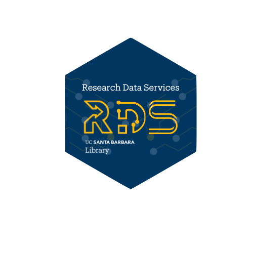

## Reproducible & Collaborative Lab Handbook

**Practical strategies to help your research group work smarter, together.**

Welcome to the _Reproducible & Collaborative Lab Handbook_, a resource developed by Research & Data Services (RDS) at the UCSB Library as a self-paced companion to the [Reproducible & Collaborative Lab Program](https://drive.google.com/file/d/17qHz0cYwI9ZyjV1CzCeTMEduMIx8Mnzf/view?usp=sharing) during which our team engages with your lab over several months. Whether you are a Principal Investigator building from the ground up or managing a current lab, a team member looking to streamline your data workflows, or a lab manager wanting to improve your lab data management, this handbook provides practices for enabling a research environment that is open, efficient, and reproducible.

We view the research lab as the primary unit of scientific production. This guide is designed to help you build sustainable systems that outlast individual project timelines, ensuring your research products—data, code, and methods—remain reusable and robust for you, your labmates, and future collaborators.

### What You’ll Find Inside

Explore these core pillars of research computing at your own pace:

- **Collaborative Coding**: Learn to leverage GitHub to manage code as a team, conduct code reviews, and streamline analytical workflows.
- **Data Management Strategy**: Develop systems to centralize, back up, and organize your lab’s data so nothing gets lost.
- **Rerunnable Workflows**: Move away from manual, error-prone steps toward transparent, automated pipelines that take you from raw data to scientific output.
- **Documentation & Preservation**: Create actionable guidelines and templates to document your research, making it easy for new members to onboard and your work to be reused.
- **"Good Enough" Scientific Programming**: research computing strategies for robust and more reusable code development scaling beyond your laptop.

### Why Use This Handbook?

By implementing the strategies in this guide, your lab builds "safety nets" for your research:

- **For the PI**: Streamline onboarding and off-boarding, reduce the risk of data loss, and ensure the long-term quality of your lab's scientific output.
- **For Lab Members**: Gain proficiency in modern computational tools and analytical strategies that will serve your career long-term.
- **For the Group**: Foster an environment where analysts and non-coders alike feel empowered to contribute to the lab’s digital infrastructure.

### How to Get Started

This handbook is designed to be explored according to your lab’s unique needs. You can jump directly to specific topics or follow our suggested learning paths.

- Use the left panel to start browsing the modules.
- While this handbook is self-paced, our team at the UCSB Library RDS is here to help. Contact us at <rds@library.ucsb.edu> if you’d like to discuss how to implement your strategies specific to lab context.

### Outcomes

- More reproducible management of your lab’s scientific products (data, code, and more!)
- Better analytical strategies for collaboration 
- Safety nets for your research lab content
- More efficient reuse of your work
- Streamlined on- and off- boarding of collaborators

### Testimony

"Participating in this program has been **absolutely invaluable** for my team. We all learned so much, from using GitHub for lab coding projects to best practices for naming files, to how to create an 'asset library' for all of the video data we collect that will be future-proof and useful for numerous unforeseen projects into the future."

_-- Dr.Eleanor Caves, former participant_

### Want to know more?

 You can read more on the RCL program in the [UCSB Current article](https://news.ucsb.edu/in-focus/librarys-new-consultation-service-targets-campus-research-labs 
). If you are interested in this program, please see the [about](about.qmd) page to connect with us.

{fig-align="center" width="55%"}
